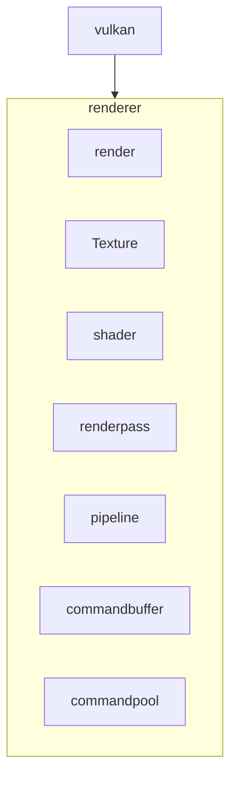

# MukkiGamesEngine

## Current Progress
- [x] abstract code from tracer rounds for basic instance and device setup
- [x] setup Vulkan instance and device
- [x] create window with GLFW
- [x] create Vulkan surface with GLFW
- [x] setup swapchain
- [x] create image views for swapchain images
- [x] create render pass
- [x] create framebuffers
- [x] create command pool and command buffers
- [x] create synchronization objects
- [x] basic rendering loop to clear screen with a color
- [ ] render 3d objects
- [ ] create scene loader
- [ ] looking into SIMD 
- [ ] multithreading for rendering and resource loading
## Architecture Diagram

## Progress
