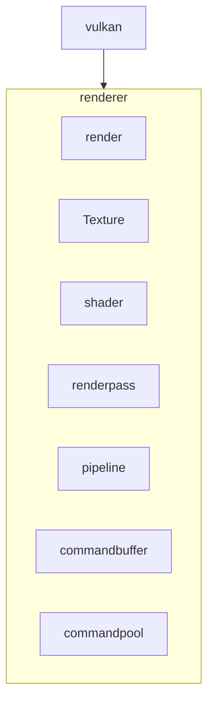
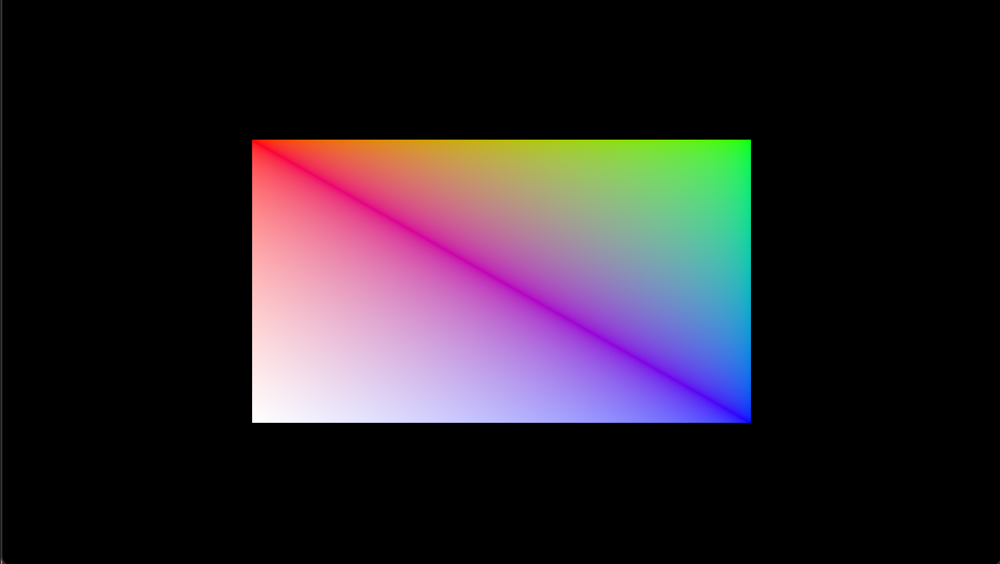

# MukkiGamesEngine

## Current Progress
- [x] abstract code from tracer rounds for basic instance and device setup
- [x] setup Vulkan instance and device
- [x] create window with GLFW
- [x] create Vulkan surface with GLFW
- [x] setup swapchain
- [x] create image views for swapchain images
- [x] create render pass
- [x] create framebuffers
- [x] create command pool and command buffers
- [x] create synchronization objects
- [x] basic rendering loop to clear screen with a color
- [x] render 3d objects
- [ ] skybox
- [ ] render cubmaps
- [ ] create scene loader
- [ ] looking into SIMD 
- [ ] multithreading for rendering and resource loading
- [ ] 
## Fixes
- [x] recreating swapchain on window resize
- [x] validation layers errors when switching from compute to graphics and back
- [ ] cleanup code maybe using RAII or smart pointers
- [ ] RAII would require bit to much refactoring right now will fix later (tech depth)
## Architecture Diagram

## Progress

## UI changes Works!

https://github.com/user-attachments/assets/0c19a22d-971b-4ff4-b9d8-ecf9d9b7e023

