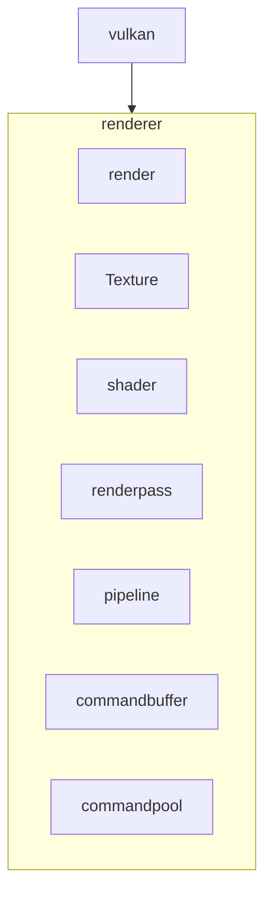

# MukkiGamesEngine

## Current Progress
- [x] abstract code from tracer rounds for basic instance and device setup
- [x] setup Vulkan instance and device
- [x] create window with GLFW
- [ ] create Vulkan surface with GLFW
- [ ] setup swapchain
- [ ] create image views for swapchain images
- [ ] create render pass
- [ ] create framebuffers
- [ ] create command pool and command buffers
- [ ] create synchronization objects
- [ ] basic rendering loop to clear screen with a color
- [ ] render 3d objects
- [ ] create scene loader

## Architecture Diagram

