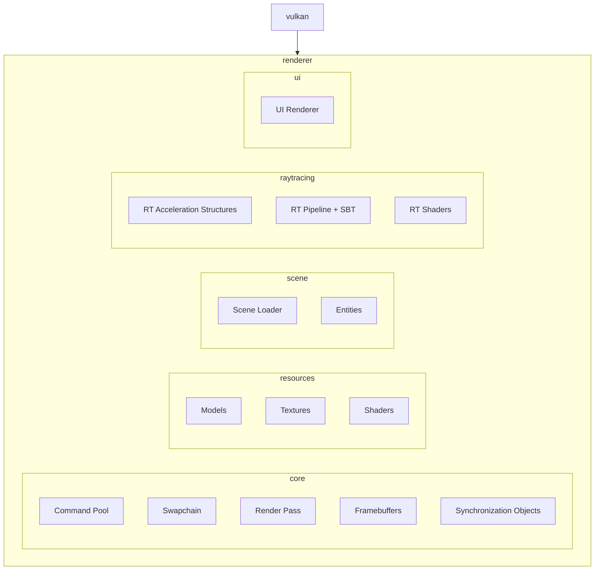

# MukkiGamesEngine

## Progress

* RayTracing 


* Shadows


* BRDF Basic Shine


* CubeMap

https://github.com/user-attachments/assets/ff565553-97be-4b4f-b2da-1129d42001f7


## Build (Windows)
### Prerequisites
- **CMake 3.31.4+** (3.16 minimum) and **Ninja**
- **Conan 2.x**
- **Vulkan SDK** (LunarG) for headers/loader + `glslc`
- **Slang** compiler for `slangc` (or `SLANG_ROOT` set)
- **Visual Studio** with MSVC toolchain + Windows SDK

### Configure & build (Release)
> Run these commands from the **x64 Native Tools Command Prompt for VS** so `cl.exe` is available.

```sh
cd Main

conan profile detect --force

# Recommended: use Conan preset with Ninja
conan install . -of build --build=missing -s build_type=Release -s compiler.cppstd=20 -c tools.cmake.cmaketoolchain:generator=Ninja
cmake --preset conan-release
cmake --build --preset conan-release
```

If you prefer not to use presets, configure directly:

```sh
cmake -S . -B build -G Ninja "-DCMAKE_TOOLCHAIN_FILE=build/conan_toolchain.cmake" -DCMAKE_BUILD_TYPE=Release
cmake --build build
```

### Debug build
Use a separate build folder for Debug to avoid mixing configs:

```sh
cd Main

conan install . -of build-debug --build=missing -s build_type=Debug -s compiler.cppstd=20 -c tools.cmake.cmaketoolchain:generator=Ninja
cmake --preset conan-debug
cmake --build --preset conan-debug
# go into build folder you adjust backends in the future and run the sample scene to load first 
cd build-debug
./MukkiGamesEngine --backend vulkan --scene ../MukkiGamesEngine/Assets/sceneTrack.json

```


## Current Progress
- [x] abstract code from tracer rounds for basic instance and device setup
- [x] setup Vulkan instance and device
- [x] create window with GLFW
- [x] create Vulkan surface with GLFW
- [x] setup swapchain
- [x] create image views for swapchain images
- [x] create render pass
- [x] create framebuffers
- [x] create command pool and command buffers
- [x] create synchronization objects
- [x] basic rendering loop to clear screen with a color
- [x] render 3d objects
- [x] skybox
- [x] render cubmaps
- [x] create scene loader
    - [x] SceneObject
    - [ ] Shader hot reloading
- [x] Basic raytracing pipeline (TLAS/BLAS, SBT, rgen/rmiss/rchit shaders)
- [x] RT lighting with shadows and BRDF
	- [x] BRDF
 	- [] Shadows	
- [x] RT cubemap skydome fallback
- [ ] looking into SIMD
- [ ] multithreading for rendering and resource loading
	- [x] std::async for model loading	

## Fixes
- [x] recreating swapchain on window resize
- [x] validation layers errors when switching from compute to graphics and back
- [x] Abstract Vulkan calls to a draw function that we pass the scene path too.
- [ ] RAII cleanup (tech depth)
	- [x] adding unique_ptrs to member variables in VkApplication
 	- [ ] fixing dangling ptrs in code after switching scenes
## Architecture Diagram

```mermaid
flowchart TD
  vulkan--> renderer
  subgraph renderer
	   subgraph core
	   		commandPool[Command Pool]
		swapchain[Swapchain]
		renderPass[Render Pass]
		framebuffers[Framebuffers]
		syncObjects[Synchronization Objects]
	   end
	   subgraph resources
		models[Models]
		textures[Textures]
		shaders[Shaders]
	   end
	   subgraph scene
		sceneLoader[Scene Loader]
		entities[Entities]
	   end
	   subgraph raytracing
		raytracingAS[RT Acceleration Structures]
		raytracingPipeline[RT Pipeline + SBT]
		raytracingShader[RT Shaders]
	   end
	   subgraph ui
		uiRenderer[UI Renderer]
	   end
  end
```


